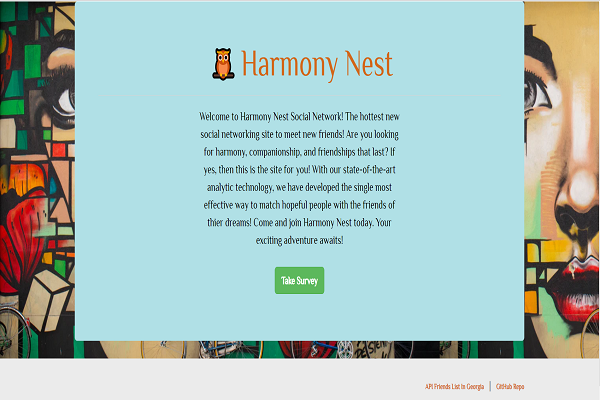

# FriendFinder

# Information

In this activity, I have built a compatibility-based "FriendFinder" application -- basically a dating app. This full-stack site will take in results from your users' surveys, then compare their answers with those from other users. The app will then display the name and picture of the user with the best overall match.

- Live Heroku Link

      

# Technologies

- JavaScript

- jQuery

- node.js

- NPM (Node Package Manager)

- Express, Path, BodyParser

- Bootstrap

- HTML/CSS

# Description

1. This survey has 10 questions of users choice. Each answer should be on a scale of 1 to 5 based on how much the user agrees or disagrees with a question.

2. The `server.js` file  require the basic npm packages : `express` and `path`.

3. The `htmlRoutes.js` file include two routes:

   * A GET Route to `/survey` which should display the survey page.
   * A default, catch-all route that leads to `home.html` which displays the home page.

4. The `apiRoutes.js` file contains two routes:

   * A GET route with the url `/api/friends`. This will be used to display a JSON of all possible friends.
   * A POST routes `/api/friends`. This will be used to handle incoming survey results. This route will also be used to handle the compatibility logic.

5. Application's data is saved inside of `app/data/friends.js` as an array of objects. Each of these objects should roughly follow the format below.

   * json
{
  "name":"Ahmed",
  "photo":"https://media.licdn.com/mpr/mpr/shrinknp_400_400/p/6/005/064/1bd/3435aa3.jpg",
  "scores":[
      5,
      1,
      4,
      4,
      5,
      1,
      2,
      5,
      4,
      1
    ]
}

6. I have determine the user's most compatible friend using the following as a guide:

   * Convert each user's results into a simple array of numbers (ex: `[5, 1, 4, 4, 5, 1, 2, 5, 4, 1]`).
   * With that done, compare the difference between current user's scores against those from other users, question by question. Add up the differences to calculate the `totalDifference`.
     * Example:
       * User 1: `[5, 1, 4, 4, 5, 1, 2, 5, 4, 1]`
       * User 2: `[3, 2, 6, 4, 5, 1, 2, 5, 4, 1]`
       * Total Difference: **2 + 1 + 2 =** **_5_**
   * I used the absolute value of the differences. Put another way: no negative solutions! And app calculates both `5-3` and `3-5` as `2`, and so on.
   * The closest match is the user with the least amount of difference.

7. Once found the current user's most compatible friend, It displays the result as a modal pop-up.
   * The modal then displays both the name and picture of the closest match and also clears the user input option's information.
